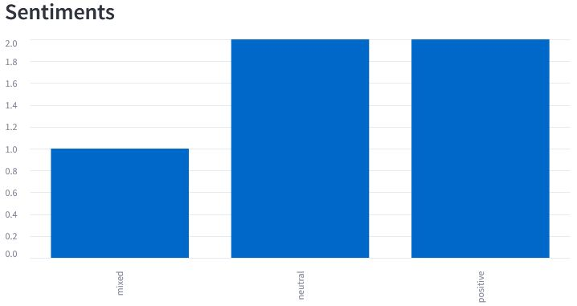
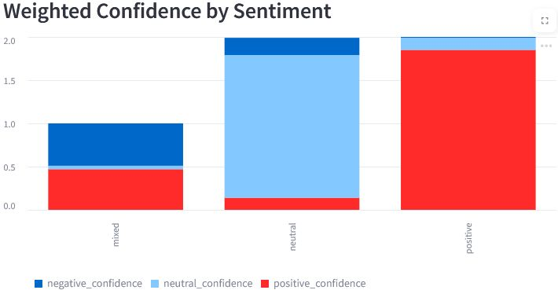
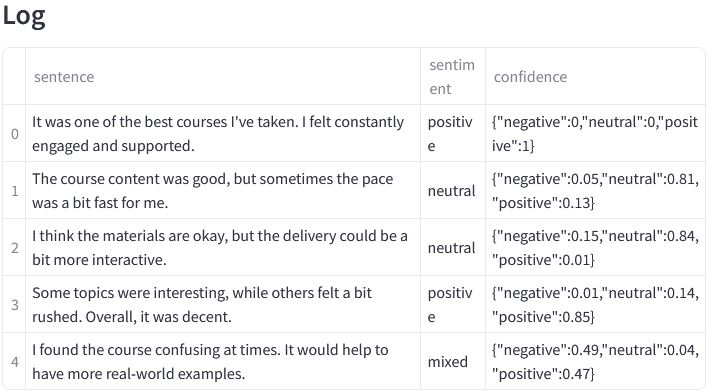
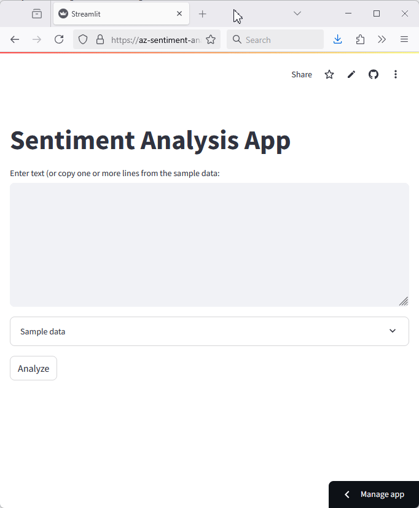
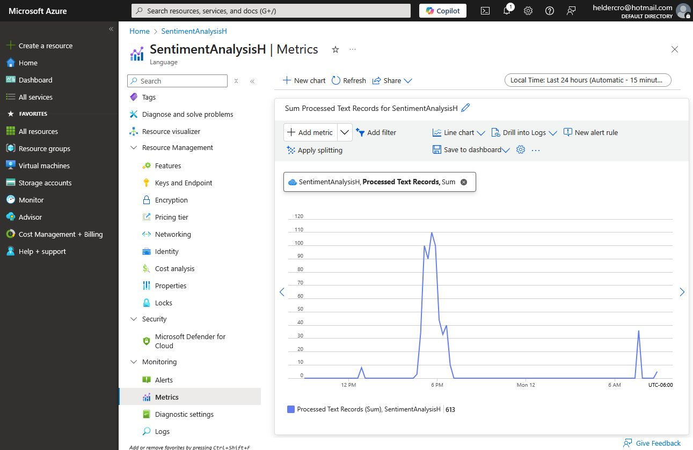

# 🧠 Sentiment Analysis App with Azure and Streamlit

This project demonstrates how to perform **sentiment analysis** using **Azure AI** and **Streamlit**. It helps teachers quickly analyze student feedback by classifying each comment as positive, neutral, or negative. Results are presented in an interactive dashboard with visual summaries and detailed tables.

For example: 
> [!TIP]
> A teacher asked the learners for feedback on the course content and how it is delivered. The answers are then inserted into an app that will send the anonymized data to the Azure service to analyze it. The services will return a score for each learner's answer based on three categories: positive, negative, and neutral. Later, the app shows a bar plot with the overall sentiment of the class based on their feedback. 


## 🛠️ Technologies Used

- Python: The app and backend were constructed in Python language.
- [Azure AI](https://azure.microsoft.com/en-us/products/ai-services/): Specifically was used the [Language Service](https://learn.microsoft.com/en-us/azure/ai-services/language-service/overview) to perform the sentiment analysis
- [Streamlit](https://streamlit.io/): for app deployment locally and online. In both modalities the app connects with Azure AI endpoint to send the data and receive the response.


## ⚙️ Setup & installation

All the needed packages are listed in the `environment.yml` file. 
The only one missing is the `streamlit` which I had to remove to faster deployment in the platform.

Therefore, the line removed was `streamlit=1.22` installed with:

`PS> conda install -c conda-forge streamlit=1.22`


## 🔄 Application Workflow

### ☁️ Azure AI Services

From Azure initial page we went to AI Services to instantiate the Language service. After creating the service, and endpoint and keys are generated and made available.


> [!IMPORTANT]  
> At the time of this writing the [Free Tier](https://azure.microsoft.com/en-us/pricing/details/cognitive-services/language-service/) allows us to execute 5,000 inferences per month!

With the endpoint and the key the connection with the service is as simple as:

```python
# this code was taken from the [AzSentimentAnalysis.py] file
credential = AzureKeyCredential(self._key)
self.conn = TextAnalyticsClient(endpoint=self._endpoint, credential=credential)
```

Since the connection with the server can be done just once, the connection mechanism was implemented as a [singleton class](https://en.wikipedia.org/wiki/Singleton_pattern). Check the file [`AzSentimentAnalysis.py`](AzSentimentAnalysis.py) for the whole code.

The Azure part of the app, backend, is complete. Now we discuss the app development.

### 📱 The App

We wanted to create something that would be easy to use and develop, that is why we decided for [Streamlit](https://streamlit.io/). The whole app code is in file [`streamlit_app.py`](streamlit_app.py). Initially it has three main parts: 

1. A text box where the teacher can insert the learners feedback, one per line.
1. A sample dataset in case of the viewer wants just to test the app.
1. The analyze button that must be clicked when the text had been inserted.

After the analyze button is clicked the data is sent to Azure servers and the response is received. For each sentence, the Language Service generates a *sentiment* (such as *positive*) and a score (such as: `{"negative":0.01,"neutral":0.07,"positive":0.92}`). All this information is analyzed and new sections are unfolded:

- Bar plot showing the overall *sentiment*:



- Bar plot showing the overall *sentiment* **weighted** by the *confidence*:



- Table with the sentences along with the *sentiment* and *confidence* inferred:



## 🚀 Live Demo

The app is temporarily deployed online: https://az-sentiment-analysis.streamlit.app/

> [!CAUTION]
> The live version is **temporarily disabled** to stay within the free tier.

To see it running check the GIF image below. 



When the app is running and the users are inserting more data, from the administrator side on Azure AI dashboard is possible to monitor the amount of requests made. As an exemplo, during our experimentation we took the screenshot below.




## 🧑‍🏫 Key Learnings

Things that I learned during this journey:

- **Using Azure AI Language Services**: how to provision and connect to Azure’s Language Service to perform real-time sentiment analysis on textual data.
- **Deploying Streamlit Applications**: built an interactive web application with Streamlit, enabling real-time user interaction and visualization.
- **Creating Effective Visualizations**: used bar plots and data tables to present the results in a clear and interpretable way for end users (e.g., educators).
- **Managing Azure Quotas and Usage**: understanding the limitations of Azure’s free tier and implemented strategies to stay within usage limits, such as local testing and temporary online deployment.
- **Enhancing Usability for Educators**: designed a workflow suitable for teachers with no technical background by simplifying the data input, analysis trigger, and results display.
